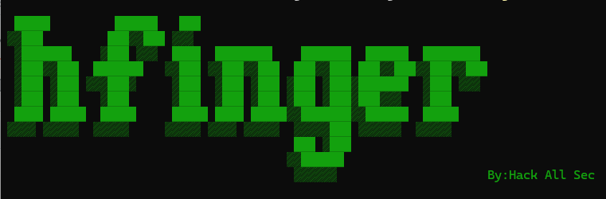

# HFinger

#### 简体中文 | [English](README_EN.md)



HFinger 是一个面向安全测试场景的服务端指纹识别工具，用于快速识别网站、Web 服务、CMS、后端框架、中间件、API 网关、WAF/CDN、负载均衡和常见服务端组件。

工具内置核心指纹规则，开箱即用；同时支持通过外置 YAML 规则扩展企业内部系统、社区规则和私有化产品识别能力。

当前内置指纹规则 **1744** 条，覆盖产品、Web 框架、CMS、中间件、CDN/WAF、蜜罐等服务端组件 **1474** 种。

## 工具定位

HFinger 的目标不是替代漏洞扫描器，而是成为安全测试链路中的服务端技术栈识别层。它关注“目标背后运行了什么服务端组件”，并通过多来源证据和置信度输出，帮助红队、渗透测试人员和企业安全团队更快完成资产理解、规则编排和后续验证。

与传统关键词匹配工具相比，HFinger 更强调：

- 核心规则内置，部署后无需额外携带规则文件
- 外置 YAML 规则，方便社区贡献和企业私有规则维护
- Header、Cookie、HTML、JS、Favicon、JSON/API、TLS、HTTP 行为、Server banner 等多证据融合
- 输出证据和置信度，便于复核和自动化编排
- 主动识别与被动代理识别同时覆盖

## 差异化能力

HFinger 的设计重点是把服务端指纹识别做成可治理、可复核、可集成的基础能力：

- 规则源统一：内置规则全部位于 `rulesets/core/*.yaml`，发布时内置到二进制；外置规则也使用同一 YAML 语义模型。
- 证据化输出：结果不仅给出产品名，还包含 category、version、confidence 和 evidence，方便人工复核与平台编排。
- 主动与被动结合：既支持批量主动识别，也支持作为 HTTP/HTTPS 代理被动沉淀访问过程中的服务端组件。
- 国密场景覆盖：主动侧支持标准 TLS 与 TLCP auto/gm/std 模式，被动 MITM 可在同一监听端口自适应标准 TLS / TLCP 握手。
- 规则质量治理：提供 `rules lint/test/stats`，支持正负样本回放，便于持续压低误报和漏报。
- 工具链集成：支持 httpx JSONL 输入、JSON/JSONL/XLSX 输出和 LLM manifest，可接入 ASM、Burp Suite、mitmproxy、nuclei、SIEM 与外部 Agent/Skill 工作流。

## 主要能力

- 服务端技术栈识别
- 主动模式和被动 MITM 模式
- 内置核心规则，开箱即用
- 外置 YAML 规则加载
- Header、Body、Title、Cookie、Status、Redirect、Favicon 等多来源匹配
- HTML Meta、DOM selector、Script src、JS/CSS Hash、Favicon mmh3/MD5/SHA1/SHA256、DNS CNAME、JSON/API、TLS 证书/ALPN/版本/Cipher、HTTP 行为和 Server banner 特征匹配
- 主动探测常见路径、API 接口、错误页、404 页面和 OPTIONS 行为
- WAF/CDN、框架、CMS、中间件、版本提取和蜜罐识别
- 识别结果包含证据与置信度
- 支持 JSON、JSONL、XML、XLSX 输出
- 支持被动模式 JSONL 结构化落盘与查询
- 支持 HTTP/1.1、HTTP/2
- 主动请求支持标准 TLS、TLCP 回退连接和客户端证书认证
- 被动 MITM 支持标准 TLS / TLCP 自适应握手
- 支持代理、随机 UA、多线程
- 提供规则校验命令，方便维护自定义规则
- 提供 LLM/Agent 机器可读能力清单，方便外部 Skill 编排渗透测试任务

## 能力覆盖

| 能力 | 当前支持方式 |
| --- | --- |
| HTTP Header 指纹 | `header.contains`、`header.regex` |
| Cookie 指纹 | `cookie.contains` |
| HTML 内容指纹 | `body.contains`、`body.regex` |
| HTML 标签 / Meta / DOM | `html.meta.contains`、`html.selector.exists`、`script.src.contains`、Body/Regex |
| JavaScript 引用路径 | `script.src.contains`、`body.contains` |
| JavaScript Hash | `script.hash.md5`、`script.hash.sha1`、`script.hash.sha256` |
| Stylesheet / CSS Hash | `stylesheet.hash.md5`、`stylesheet.hash.sha1`、`stylesheet.hash.sha256` |
| Favicon 指纹 | `favicon.hash`、`favicon.hash.md5`、`favicon.hash.sha1`、`favicon.hash.sha256` |
| 静态资源路径 | 主动 probe、`path.exists`、`script.src.contains`、Body/Regex |
| 404 / 错误页指纹 | 默认 error-page 探测与规则级 probe |
| TLS/HTTPS 指纹 | 证书 Subject/Issuer/DNSNames、ALPN、TLS 版本、Cipher、JA3S 风格摘要 |
| HTTP 协议行为 | HTTP 版本、OPTIONS Allow、压缩、ETag、Accept-Ranges、状态码、重定向 |
| 主动探测 / API 指纹 | 规则 `probes.request` 支持 method/path/header/body |
| WAF/CDN / 框架 / CMS / 中间件 | 内置分类规则、DNS CNAME、Header/Cookie/Body/TLS 与行为探测 |
| 版本特征 | `extract` 正则提取版本 |
| 综合识别 | score/any/all、negative、confidence、evidence |
| 蜜罐识别 | 明确蜜罐产品规则 + 多产品冲突/异常响应/响应相似度启发式识别 |

## 项目结构

```text
.
├── cmd/                 命令行参数与子命令
├── config/              全局配置与结果结构
├── docs/                用户文档与规则 Wiki
├── icon_hash/           favicon hash 辅助工具
├── logger/              日志输出
├── models/              主动扫描与被动代理识别逻辑
├── output/              JSON、JSONL、XML、XLSX 输出
├── rules/               内置规则、YAML 加载、规则校验与匹配引擎
├── rulesets/            内置 YAML 规则源，发布时内置到二进制
├── utils/               HTTP、证书、升级等通用能力
├── README.md            中文说明文档
└── README_EN.md         英文说明文档
```

## 适用场景

- 红队打点阶段快速了解目标服务端技术栈
- 渗透测试前的信息收集
- 被动代理流量中的服务端组件识别
- 企业内部资产技术栈盘点
- 私有化产品或定制系统指纹规则维护

## 安装

```bash
git clone https://github.com/HackAllSec/hfinger.git
cd hfinger
go build
```

## 使用方法

### 单目标识别

```bash
hfinger -u https://www.example.com
```

### 从文件读取目标

```bash
hfinger -f targets.txt
```

目标文件每行一个 URL，建议包含协议，例如：

```text
https://www.example.com
http://192.168.1.10
```

`-f` 也支持常见 JSONL 探活结果，例如 `httpx -json` 输出。工具会优先读取 `url` 字段，其次读取 `input` / `host` 并结合 `scheme` 生成目标：

```bash
httpx -l domains.txt -json -silent > alive.jsonl
hfinger -f alive.jsonl -j fingerprint-results.json
hfinger -f alive.jsonl --output-jsonl fingerprint-results.jsonl
```

### 指定代理

```bash
hfinger -u https://www.example.com -p http://127.0.0.1:8080
```

### 加载外置 YAML 规则

```bash
hfinger -u https://www.example.com --rules ./rules/custom.yaml
hfinger -f targets.txt --rules ./rules/community/
```

`--rules` 可以指定单个 YAML 文件，也可以指定目录，并且可以多次使用。

### 输出结果

```bash
hfinger -f targets.txt -j result.json
hfinger -f targets.txt -x result.xml
hfinger -f targets.txt -s result.xlsx
```

输出结果会包含命中产品、类别、版本、状态码、Server、Title、置信度和证据。

### 被动模式

启动本地代理监听：

```bash
hfinger -l 127.0.0.1:8888 -s result.xlsx --passive-store passive.jsonl
```

浏览器或其它工具将代理设置为 `127.0.0.1:8888` 后，HFinger 会在转发流量的同时识别响应中的服务端指纹。
长时间运行时可以启用 JSONL 轮转，避免单个结果文件持续膨胀：

```bash
hfinger -l 127.0.0.1:8888 --passive-store passive.jsonl --passive-store-max-bytes 104857600
```

如需联动上游代理：

```bash
hfinger -l 127.0.0.1:8888 -p http://127.0.0.1:7777 -s result.xlsx --passive-store passive.jsonl
```

HTTPS 被动识别需要将 `certs` 目录下生成的证书导入浏览器或系统信任区。标准 TLS 客户端导入 `ca.crt`，TLCP 客户端导入 `gm_ca.crt`。

说明：被动模式使用自适应 TLS/TLCP 握手。标准 TLS 客户端和 TLCP 客户端会在同一监听端口下自动选择对应握手流程。

### 双向 TLS / TLCP

当目标服务要求客户端证书时，可以提供客户端证书和私钥：

```bash
hfinger -u https://www.example.com --client-cert client.crt --client-key client.key
```

TLCP 单证书认证目标可以单独提供国密客户端证书：

```bash
hfinger -u https://www.example.com --gm-client-cert gm-client.crt --gm-client-key gm-client.key
```

TLCP 双证书认证目标可以显式提供签名证书和加密证书：

```bash
hfinger -u https://www.example.com \
  --gm-client-sign-cert gm-sign.crt --gm-client-sign-key gm-sign.key \
  --gm-client-enc-cert gm-enc.crt --gm-client-enc-key gm-enc.key
```

如果只提供 `--client-cert/--client-key`，工具会优先将其用于标准 TLS，并尝试作为 TLCP 单证书客户端证书加载；如果国密客户端证书与标准 TLS 证书不同，建议显式使用 `--gm-client-cert/--gm-client-key` 或 TLCP 双证书参数。

### 主动 TLS 模式

主动请求默认使用 `auto` 模式，用户不需要额外指定参数。`auto` 会先尝试标准 TLS；如果标准 TLS 失败且错误特征符合国密传输场景，再自动尝试 TLCP。

当前内置国密传输能力选择 GoTLCP 作为唯一 provider，支持 TLCP 的 `ECC_SM4_GCM_SM3(0xe053)`、`ECC_SM4_CBC_SM3(0xe013)`、`ECDHE_SM4_GCM_SM3(0xe051)`、`ECDHE_SM4_CBC_SM3(0xe011)`。如果目标使用当前 provider 仍不支持的协议变体或套件，工具会在连接失败信息中提示当前支持范围。

如果已经明确目标类型，可以强制指定模式：

```bash
# 查看当前内置 TLS / 国密能力
hfinger tls capabilities

# 只走 TLCP 国密传输
hfinger -u https://www.example.com --tls-mode gm

# 只走标准 TLS，不做 TLCP fallback
hfinger -u https://www.example.com --tls-mode std
```

查询被动模式 JSONL 结果：

```bash
hfinger passive query passive.jsonl
hfinger passive query passive.jsonl --cms Cloudflare --min-confidence 80 --limit 100
```

## 与其他工具联动

HFinger 可以作为信息收集链路中的指纹识别层，与常见安全工具组合使用。推荐让探活、路径发现、漏洞验证工具各司其职，HFinger 负责把目标转化为可编排的服务端技术栈结果。

### httpx / 自研探活 -> HFinger

```bash
# 1. 子域或资产列表先交给 httpx 探活
httpx -l domains.txt -silent > alive.txt

# 2. HFinger 对存活 URL 做证据化指纹识别
hfinger -f alive.txt -j fingerprint-results.json
```

如果已有自研 ASM 或资产平台，只需要导出一行一个 URL 的文件即可：

```bash
hfinger -f asm-alive-urls.txt -j fingerprint-results.json -s hfinger.xlsx
```

### katana / ffuf -> HFinger 多路径识别

当首页没有足够特征时，可以先发现更多路径，再交给 HFinger 识别：

```bash
# katana 发现路径
katana -list alive.txt -silent -d 2 > discovered-urls.txt

# ffuf 或其它目录发现工具也可以输出 URL 列表
ffuf -w paths.txt -u https://www.example.com/FUZZ -mc all -of csv -o ffuf.csv

# 将发现到的 URL 交给 HFinger 批量识别
hfinger -f discovered-urls.txt -j hfinger-paths.json
```

### Burp Suite / mitmproxy -> HFinger 被动识别

HFinger 可以放在浏览器、Burp Suite 或 mitmproxy 的代理链路中，边浏览边沉淀服务端指纹。

```bash
# HFinger 监听本地代理，并把流量继续转发到 Burp Suite
hfinger -l 127.0.0.1:8888 -p http://127.0.0.1:8080 --passive-store passive.jsonl

# 浏览器代理设置为 127.0.0.1:8888
# Burp Suite 监听 127.0.0.1:8080
```

查询被动识别结果：

```bash
hfinger passive query passive.jsonl
hfinger passive query passive.jsonl --category api-gateway --min-confidence 80
hfinger passive query passive.jsonl --cms Nacos
```

### HFinger -> nuclei 精准验证

HFinger 不替代漏洞扫描器。更推荐先识别组件，再按组件选择 nuclei 模板，减少无效请求和误报。

```bash
# 识别资产
hfinger -f alive.txt -j fingerprint-results.json

# 示例：提取 Nacos 目标，再运行 Nacos 相关 nuclei 模板
jq -r '.[] | select(.cms | test("Nacos"; "i")) | .url' fingerprint-results.json > nacos-targets.txt
nuclei -l nacos-targets.txt -tags nacos -o nuclei-nacos.txt

# 示例：提取 Swagger / OpenAPI 目标
jq -r '.[] | select(.cms | test("Swagger|OpenAPI"; "i")) | .url' fingerprint-results.json > api-docs-targets.txt
nuclei -l api-docs-targets.txt -tags exposure,swagger,openapi -o nuclei-api-docs.txt
```

### nmap / 协议扫描 -> HFinger Web 侧补充

nmap 适合识别端口和协议 banner，HFinger 适合识别 HTTP/HTTPS 服务端组件。可以先用 nmap 找 Web 端口，再整理为 URL：

```bash
nmap -p 80,443,8080,8443,9000,9090 -oX nmap.xml 192.168.1.0/24

# 将 nmap 结果转换为 URL 列表后交给 HFinger
hfinger -f web-urls-from-nmap.txt -j hfinger-nmap.json
```

### JSON / JSONL -> ASM、SIEM 和自定义脚本

HFinger 的 JSON 输出适合进入资产平台、SIEM 或自定义编排脚本。建议下游重点消费这些字段：

- `url`：目标地址
- `cms`：命中的产品或组件
- `category`：组件类别
- `confidence`：置信度
- `evidence`：命中证据
- `server` / `title` / `statuscode`：辅助上下文

示例：

```bash
# 高置信度组件清单
jq -r '.[] | select(.confidence >= 80) | [.url, .cms, .category, .confidence] | @tsv' fingerprint-results.json

# 按组件类型拆分任务
jq -r '.[] | select(.category == "waf" or .category == "cdn") | .url' fingerprint-results.json > edge-assets.txt
jq -r '.[] | select(.category == "middleware") | .url' fingerprint-results.json > middleware-assets.txt
```

## 规则管理

HFinger 内置核心规则，用户和社区规则使用 YAML 编写。

### 规则治理与内置规则源

所有内置规则源统一放在 `rulesets/core/*.yaml`，发布时随二进制内置。

内置规则按来源层级和组件类别拆分：

- `curated-*.yaml`：持续治理的高价值服务端规则。
- `migrated-*.yaml`：已标准化为统一 YAML schema 的存量规则，按组件类别拆分维护。

这种拆分只影响维护方式，不影响运行时性能；程序启动后会统一加载并编译为内存中的运行时规则结构。

治理原则：

- 内置规则统一使用 YAML 语义模型：`id/name/category/vendor/tags/match/negative/metadata/examples`
- 新增核心规则必须提供明确 evidence、分类、引用和正负样本
- 社区贡献优先提交 YAML 规则，内置规则由维护者审核后随版本发布
- 规则质量以 `rules lint` 和 `rules test` 为准，不以规则数量作为主要指标
- 规则 Schema 位于 `schemas/rule.schema.json`，可在 IDE 中关联 YAML 文件进行字段和 matcher 类型校验

推荐的新规则分类包括：

```text
cms, oa, middleware, api-gateway, devops, cloud-native,
observability, storage, database, security-device, cdn, waf,
framework, ai-service, iot-device
```

查看当前运行时规则分布：

```bash
hfinger rules stats
```

输出包含规则总量、产品数量、lint error/warning 计数、`tier.curated` / `tier.migrated` 分层统计、各 tier 的 lint 分布，以及各 category 的规则分布。

查看规则治理优先级：

```bash
hfinger rules doctor
hfinger rules doctor --max-rules 0
```

`rules doctor` 会聚合 lint 问题、输出高频问题类型，并列出最需要治理的规则及建议修复方向。`--max-rules 0` 只输出汇总，适合 CI 基线检查。

校验外置规则：

```bash
hfinger rules lint ./rules/custom.yaml
hfinger rules lint ./rules/community/
```

测试外置规则：

```bash
hfinger rules test ./rules/community/
```

`rules test` 支持规则内的正负样本回放，适合在提交社区规则前降低误报和漏报风险。

规则编写说明：

- [中文规则 Wiki](docs/RULES_WIKI.md)
- [English Rules Wiki](docs/RULES_WIKI_EN.md)

规则 Wiki 中提供了 AI 辅助生成规则草案的提示词模板。AI 输出仅建议作为草案，提交前仍需人工审核并通过 `rules lint/test`。

## YAML 规则示例

```yaml
id: example-admin
name: Example Admin
category: web
tags:
  - admin
  - example

match:
  strategy: score
  threshold: 80
  probes:
    - id: homepage
      request:
        method: GET
        path: /
      matchers:
        - type: title.contains
          value: Example Admin
          weight: 50
          evidence: 页面标题命中
        - type: header.contains
          key: Set-Cookie
          value: example_session
          weight: 40
          evidence: Cookie 特征命中

negative:
  - type: body.contains
    value: unrelated product
    reason: 排除相似页面误报

metadata:
  references:
    - https://example.com
```

## 输出示例

```json
[
  {
    "url": "https://www.example.com",
    "cms": "Example Admin",
    "category": "web",
    "version": "1.2.3",
    "server": "nginx",
    "statuscode": 200,
    "title": "Example Admin",
    "confidence": 100,
    "evidence": [
      {
        "source": "title",
        "matcher_type": "title.contains",
        "matched_value": "Example Admin",
        "weight": 50,
        "message": "页面标题命中",
        "response_url": "https://www.example.com"
      }
    ]
  }
]
```

## 命令行参数

```text
-u, --url string           指定单个识别目标
-f, --file string          从文件读取目标，支持纯 URL 列表或 httpx JSONL
-l, --listen string        启动被动代理监听
-p, --proxy string         指定上游代理
-t, --thread int           指定线程数
-r, --redirect int         最大重定向次数
    --rules stringArray    加载外置 YAML 规则文件或目录
    --passive-store string 被动模式结果 JSONL 落盘路径
    --passive-store-max-bytes int
                           被动 JSONL 文件超过指定字节数后自动轮转，0 表示关闭
    --client-cert string   双向 TLS 客户端证书
    --client-key string    双向 TLS 客户端私钥
    --gm-client-cert string TLCP 单证书客户端证书
    --gm-client-key string  TLCP 单证书客户端私钥
    --gm-client-sign-cert string TLCP 双证书签名客户端证书
    --gm-client-sign-key string  TLCP 双证书签名客户端私钥
    --gm-client-enc-cert string TLCP 双证书加密客户端证书
    --gm-client-enc-key string  TLCP 双证书加密客户端私钥
    --tls-mode string      主动请求 TLS 模式：auto、gm、std
-j, --output-json string   输出 JSON 文件
    --output-jsonl string  输出 JSONL 文件，便于 LLM/Agent/脚本流水线消费
-x, --output-xml string    输出 XML 文件
-s, --output-xlsx string   输出 XLSX 文件
-c, --check-update         检查工具更新
    --update               显示规则更新说明
    --upgrade              升级工具
-v, --version              显示版本
```

被动结果查询：

```text
hfinger passive query [jsonl-file]
    --url string             按 URL 片段过滤
    --cms string             按产品名过滤
    --category string        按类别过滤
    --min-confidence int     按最低置信度过滤
    --limit int              限制返回记录数量
```

### LLM / Agent / Skill 集成

HFinger 不把 LLM 放进最终指纹判定链路。LLM/Agent 应该把 HFinger 当作确定性工具调用：HFinger 负责扫描、匹配、输出证据和置信度，LLM/Skill 负责读取结构化结果并完成普通 CLI 参数无法直接完成的编排、分诊和解释任务。

查看机器可读能力清单：

```text
hfinger llm manifest
```

查看外部 Agent 可参考的 Skill 模板：

```text
hfinger llm skills
```

批量扫描并输出 JSONL，供 LLM/Agent 流式消费：

```bash
hfinger -f alive.jsonl --output-jsonl hfinger-results.jsonl
```

典型 LLM/Skill 场景：

- 资产分诊：读取 `hfinger-results.jsonl`，按 `category`、`cms`、`version`、`confidence` 和 `evidence` 归类，输出优先测试目标。
- 工具链编排：把高置信度 API 网关、DevOps、管理后台、安全设备等结果转换为 nuclei、ffuf、katana、nmap 的输入。
- 规则生成：根据 HTTP Header、Cookie、Body、Favicon、DNS CNAME、TLS 证书、JS/CSS Hash 等证据生成 YAML 规则草案，再由 `rules lint/test/doctor` 校验。
- 规则审查：检查规则是否依赖泛化关键词、是否缺少 strong evidence、negative 和 positive/negative 样本。
- 蜜罐研判：当结果出现 `category: honeypot`、`Potential Honeypot`、多个冲突技术栈或多路径相似响应时，降低主动探测强度并生成低风险确认建议。
- 报告解释：把 evidence 和 confidence 转换为面向安全报告的可审计说明。

Skill 是外部 Agent 的工作流能力，不是 HFinger 仓库必须携带的运行时目录。用户可以在自己的 Agent 环境中编写 Skill，让 Skill 调用 `hfinger llm manifest`、`hfinger llm skills`、`hfinger --output-jsonl`、`hfinger rules lint/test/doctor` 等命令完成更复杂的渗透测试任务。

## 合法使用与免责声明

HFinger 仅用于获得授权的安全测试、资产识别、企业内部安全治理和研究学习。

此类工具具备批量探测和指纹识别能力，可能被滥用于未授权扫描。使用者必须确保自己对目标系统拥有明确授权，并遵守适用法律法规、合同约定和测试范围。

开发者不对任何未授权使用、攻击行为、数据泄露、业务中断或其它后果承担责任。使用本工具即表示你理解并接受上述限制。

## 贡献

欢迎提交 Issue、PR 和 YAML 指纹规则。提交规则前建议先运行：

```bash
hfinger rules lint ./rules/your-rule.yaml
hfinger rules test ./rules/your-rule.yaml
```

## 许可

请遵守 [Apache License 2.0](LICENSE)。
